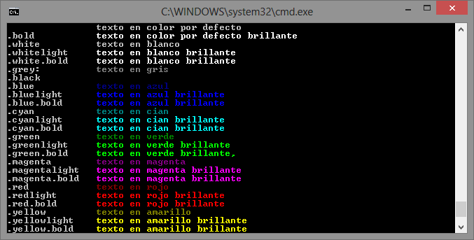

#KCOLOR#

Módulo para node.js que permite mostrar de forma sencilla de colores en las salidas de texto por consola.

###Utilización###

Para cargar kcolor en nuestro proyecto node.js solo hay que ubicar el fichero `kcolor.js` en una carpeta de nuestro proyecto y cargar el módulo con:

		require('kcolor.js');

Para dotar de color a un texto que queramos utilizar en la consola debemos que utilizar `console.log('texto'.`*color*`);`

Ejemplos:

		console.log('error'.red);
		console.log('aviso'.yellow);

kcolor es compatible con todas las funcionalidades de console.log, como argumentos printf y concatenación de parámetros.

		var myNumber = 400;
		var myText = 'is a test';
		console.log('myObject=' + '%j'.bluelight 
			+ ' myMumber=' + '%d'.yellowlight 
			+ ' myText=' + '%s'.greenlight, myObject, myNumber, myText );
		
Este es el aspecto en una consola en windows

		console.log('\t\ttexto en color por defecto');
		console.log('.bold\t\t' 	+ 'texto en color por defecto brillante'.bold);
		console.log('.white\t\t' 	+ 'texto en blanco'.white );
		console.log('.whitelight\t' + 'texto en blanco brillante'.whitelight );
		console.log('.white.bold\t' + 'texto en blanco brillante'.white.bold );
		console.log('.grey:\t\t' 	+ 'texto en gris'.grey );
		console.log('.black\t\t' 	+ 'texto en negro'.black );
		console.log('.blue\t\t' 	+ 'texto en azul'.blue );
		console.log('.bluelight\t' 	+ 'texto en azul brillante'.bluelight );
		console.log('.blue.bold\t'	+ 'texto en azul brillante'.blue.bold );
		console.log('.cyan\t\t' 	+ 'texto en cian'.cyan );
		console.log('.cyanlight\t' 	+ 'texto en cian brillante'.cyanlight );
		console.log('.cyan.bold\t' 	+ 'texto en cian brillante'.cyan.bold );
		console.log('.green\t\t' 	+ 'texto en verde'.green );
		console.log('.greenlight\t' + 'texto en verde brillante'.greenlight );
		console.log('.green.bold\t' + 'texto en verde brillante,'.greenlight );
		console.log('.magenta\t' 	+ 'texto en magenta'.magenta );
		console.log('.magentalight\t' + 'texto en magenta brillante'.magentalight );
		console.log('.magenta.bold\t' + 'texto en magenta brillante'.magenta.bold );
		console.log('.red\t\t' 		+ 'texto en rojo'.red );
		console.log('.redlight\t' 	+ 'texto en rojo brillante'.redlight );
		console.log('.red.bold\t' 	+ 'texto en rojo brillante'.red.bold );
		console.log('.yellow\t\t' 	+ 'texto en amarillo'.yellow );
		console.log('.yellowlight\t' + 'texto en amarillo brillante'.yellowlight );
		console.log('.yellow.bold\t' + 'texto en amarillo brillante'.yellow.bold )

Si se quiere desactiva la visualización de colores en los mensajes sin remover las llamadas a KCOLOR, sólo tiene que configurar la variable de entorno KCOLOR con el valor DISABLED antes de llamar a node.js con su proyecto.

		set KCOLOR=DISABLED
		node app.js

##Referencia##

###white###

Muestra el texto en color blanco.

		console.log('texto en blanco: '.white + 'texto en color por defecto'); 

###whitelight###

Muestra el teto en color blanco brillante.

		console.log('texto en blanco brillante: '.whitelight + 'texto en color por defecto');
###grey###

Muestra el teto en color gris.

		console.log('texto en gris: '.grey + 'texto en color por defecto');

###black###

Muestra el teto en color negro.

		console.log('texto en negro: '.black + 'texto en color por defecto');

###blue###

Muestra el teto en color azul.

		console.log('texto en azul: '.blue + 'texto en color por defecto');

###bluelight###

Muestra el teto en color azul brillante.

		console.log('texto en azul brillante: '.bluelight + 'texto en color por defecto');

###cyan###

Muestra el teto en color cian.

		console.log('texto en cian: '.cyan + 'texto en color por defecto');

###cyanlight###

Muestra el teto en color cian brillante.

		console.log('texto en cian brillante: '.cyanlight + 'texto en color por defecto');

###green###

Muestra el teto en color verde.

		console.log('texto en verde: '.green + 'texto en color por defecto');

###greenlight###

Muestra el teto en color verde brillante.

		console.log('texto en verde brillante: '.greenlight + 'texto en color por defecto');

###magenta###

Muestra el teto en color magenta.

		console.log('texto en magenta: '.magenta + 'texto en color por defecto');

###magentalight###

Muestra el teto en color magenta brillante.

		console.log('texto en magenta brillante: '.magentalight + 'texto en color por defecto');

###red###

Muestra el teto en color rojo.

		console.log('texto en rojo: '.red + 'texto en color por defecto');

###redlight###

Muestra el teto en color rojo brillante.

		console.log('texto en rojo brillante: '.redlight + 'texto en color por defecto');

###yellow###

Muestra el teto en color amarillo.

		console.log('texto en amarillo: '.yellow + 'texto en color por defecto');

###yellowlight###

Muestra el teto en color amarillo brillante.

		console.log('texto en amarillo brillante: '.yellowlight + 'texto en color por defecto');

###bold###

Muestra un color como brillante. Se puede utilizar como modificador de los colores básicos, aunque se recomienda usar los colores terminados en light.

		console.log('texto en color por defecto brillante, '.bold + 'texto en verde brillante'.green.bold);

----------
4/10/2013 6:40:27 PM 

